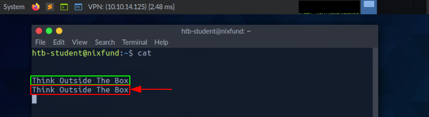
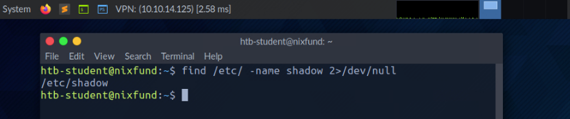
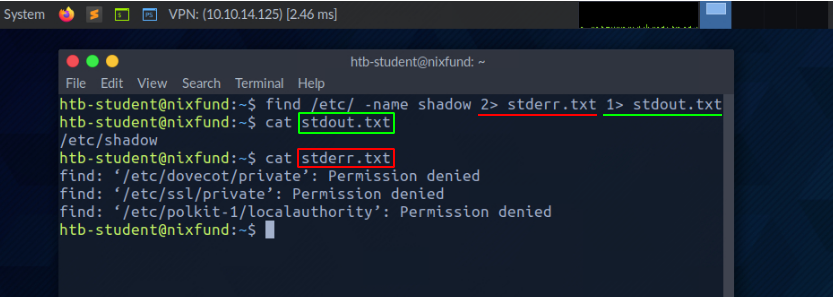
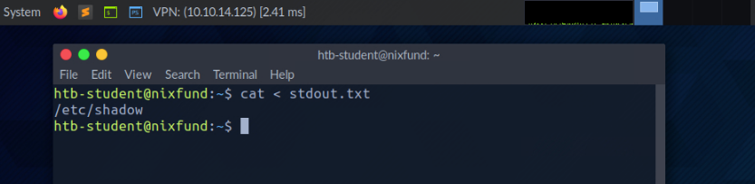
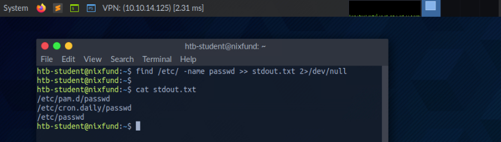
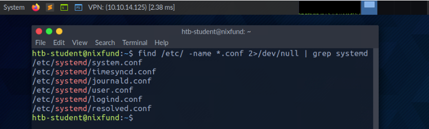

# 11 - Descriptores de Archivos y Redirecciones  
**Fundamentos de Linux – Página 11**

---

## Descriptores de Archivos y Redirecciones

Un descriptor de archivo (FD) en los sistemas operativos Unix/Linux es una referencia mantenida por el núcleo (kernel), que permite al sistema gestionar operaciones de Entrada/Salida (I/O). Actúa como un identificador único para un archivo abierto, socket u otro recurso de I/O. En sistemas basados en Windows, esto se conoce como "file handle". Esencialmente, el descriptor de archivo es la forma en que el sistema rastrea conexiones activas de I/O, como leer o escribir en un archivo.

Piénsalo como un número de ticket que obtienes al dejar tu abrigo en una guardarropía. El ticket (descriptor de archivo) representa tu conexión con tu abrigo (archivo o recurso), y cada vez que necesitas recuperarlo (realizar I/O), presentas el ticket al encargado (sistema operativo), quien sabe exactamente dónde está almacenado tu abrigo (a qué recurso se refiere el descriptor). Sin el ticket, no habría manera eficiente de acceder a tu abrigo entre tantos otros, así como sin un descriptor de archivo, el sistema operativo no sabría con qué recurso interactuar. Pronto verás por qué los descriptores son tan importantes y por qué entenderlos es crucial en los ejemplos que vienen.

Por defecto, los tres primeros descriptores en Linux son:

- **Flujo de Entrada de Datos**
  - STDIN – 0
- **Flujo de Salida de Datos**
  - STDOUT – 1
- **Flujo de Salida de Errores**
  - STDERR – 2

---

## STDIN y STDOUT

Veamos un ejemplo con `cat`. Al ejecutarlo, damos entrada estándar (STDIN - FD 0), marcado en verde, por ejemplo: "SOME INPUT". Al confirmar con [ENTER], se devuelve en salida estándar (STDOUT - FD 1), marcado en rojo.



---

## STDOUT y STDERR

En el siguiente ejemplo, usando `find`, veremos:

```bash
foonkeemoonkee@htb[/htb]$ find /etc/ -name shadow
```

- STDOUT (FD 1) en verde  
- STDERR (FD 2) en rojo


---

## Redirigir STDERR a /dev/null

```bash
foonkeemoonkee@htb[/htb]$ find /etc/ -name shadow 2>/dev/null
```



---

## Redirigir STDOUT a un archivo
Ahora podemos ver que todos los errores (STDERR) que antes se mostraban con "Permission denied" ya no aparecen. El único resultado que vemos ahora es la salida estándar (STDOUT), la cual también podemos redirigir a un archivo llamado `results.txt`, que contendrá únicamente la salida estándar sin los errores estándar.
```bash
foonkeemoonkee@htb[/htb]$ find /etc/ -name shadow 2>/dev/null > results.txt
foonkeemoonkee@htb[/htb]$ cat results.txt
```


---

## Redirigir STDOUT y STDERR a archivos separados
Deberíamos haber notado que no usamos un número antes del signo mayor que (>) en el ejemplo anterior. Esto se debe a que redirigimos todos los errores estándar al "dispositivo nulo" anteriormente, y la única salida que obtenemos es la salida estándar (FD 1 - STDOUT). Para hacerlo más preciso, redirigiremos el error estándar (FD 2 - STDERR) y la salida estándar (FD 1 - STDOUT) a archivos diferentes.
```bash
foonkeemoonkee@htb[/htb]$ find /etc/ -name shadow 2> stderr.txt 1> stdout.txt
```



---

## Redirigir STDIN
Como ya hemos visto, en combinación con los descriptores de archivo, podemos redirigir errores y salidas usando el signo mayor que (>). Esto también funciona con el signo menor que (<). Sin embargo, el signo menor que se utiliza como entrada estándar (FD 0 - STDIN). Estos caracteres pueden verse como una “dirección” en forma de flecha que nos indica “desde dónde” y “hacia dónde” deben redirigirse los datos. Usamos el comando `cat` para utilizar el contenido del archivo "stdout.txt" como entrada estándar (STDIN).
```bash
foonkeemoonkee@htb[/htb]$ cat < stdout.txt
```



---

## Redirigir STDOUT y añadir (append) a un archivo
Cuando usamos el signo mayor que (>) para redirigir nuestra salida estándar (STDOUT), se crea automáticamente un nuevo archivo si este no existe. Si el archivo ya existe, será sobrescrito sin pedir confirmación. Si queremos **añadir** la salida estándar a un archivo existente, podemos usar el doble signo mayor que (>>).
```bash
foonkeemoonkee@htb[/htb]$ find /etc/ -name passwd >> stdout.txt 2>/dev/null
foonkeemoonkee@htb[/htb]$ cat stdout.txt
```



---

## Redirigir STDIN mediante flujo
Redirigir el flujo de entrada estándar a un archivo

También podemos usar el doble signo menor que (<<) para ingresar nuestra entrada estándar a través de un flujo (_stream_). Podemos utilizar la llamada función End-Of-File (EOF) de un archivo del sistema Linux, que define el final de la entrada. En el siguiente ejemplo, usaremos el comando `cat` para leer nuestra entrada en flujo y redirigirla a un archivo llamado "stream.txt".
```bash
foonkeemoonkee@htb[/htb]$ cat << EOF > stream.txt
Hack The Box
EOF
foonkeemoonkee@htb[/htb]$ cat stream.txt
```


---

## Pipes
Otra forma de redirigir la salida estándar (STDOUT) es utilizando _pipes_ (|). Estos son útiles cuando queremos que la salida estándar de un programa sea procesada por otro. Una de las herramientas más utilizadas para esto es `grep`, que usaremos en el siguiente ejemplo. `Grep` se utiliza para filtrar la salida estándar según el patrón que definamos. En el ejemplo siguiente, usamos el comando `find` para buscar todos los archivos en el directorio "/etc/" que tengan la extensión ".conf". Cualquier error se redirige al "dispositivo nulo" (/dev/null). Usando `grep`, filtramos los resultados y especificamos que solo se muestren las líneas que contengan el patrón "systemd".
```bash
foonkeemoonkee@htb[/htb]$ find /etc/ -name *.conf 2>/dev/null | grep systemd
```



---

## Pipes encadenados

```bash
foonkeemoonkee@htb[/htb]$ find /etc/ -name *.conf 2>/dev/null | grep systemd | wc -l
```


---

## Final

Ahora que tenemos una comprensión fundamental de los descriptores de archivo, redirecciones y pipes, podemos estructurar nuestros comandos de manera más eficiente para extraer exactamente la información que necesitamos. Este conocimiento nos permite manipular cómo fluye la entrada y salida entre archivos, procesos y el sistema, lo que nos permite manejar datos de forma más efectiva. Aprovechando estas herramientas, podemos simplificar tareas, evitar pasos innecesarios y trabajar con recursos del sistema de forma mucho más organizada y eficiente, mejorando nuestra productividad y precisión.

## Preguntas

¡Responde la(s) siguiente(s) pregunta(s) para completar esta sección y ganar cubos!

**Sistema objetivo:** ¡Haz clic aquí para iniciar el sistema objetivo!

Conéctate por **SSH** con el usuario `"htb-student"` y la contraseña `"HTB_@cademy_stdnt!"`

- ¿Cuántos archivos con la extensión ".log" existen en el sistema?
- 32
  ¿Cuántos paquetes en total están instalados en el sistema objetivo?
- 737
```

Simplemente sigue el mismo proceso: edita el archivo en GitHub, pega este contenido, previsualiza para confirmar que todo se ve bien y guarda los cambios. ¡Estás a punto de tener unos apuntes perfectamente documentados y visuales!
