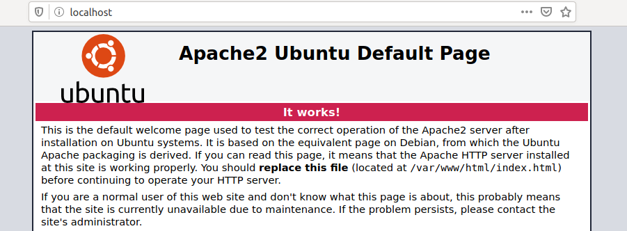
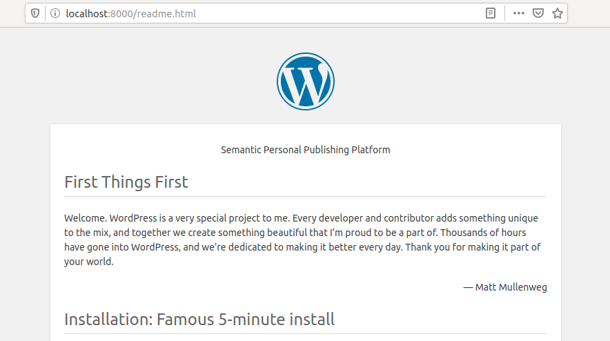

# Trabajando con Servicios Web

Otro elemento crucial en el desarrollo web es la comunicación entre los navegadores y los servidores web. Configurar un servidor web en un sistema operativo Linux se puede hacer de varias maneras, con opciones populares que incluyen Nginx, IIS y Apache. Entre estos, Apache es uno de los servidores web más utilizados. Piensa en Apache como el motor que impulsa tu sitio web, asegurando una comunicación fluida entre tu sitio web y los visitantes.

También podemos pensar en Apache como los cimientos y la estructura de una casa. Así como puedes agregar diferentes habitaciones o personalizar características en una casa, Apache se puede extender con módulos, cada uno diseñado para un propósito específico, ya sea para asegurar la comunicación, redirigir el tráfico o dar forma dinámica al contenido, como un diseñador de interiores que reorganiza las habitaciones para que se ajusten a tus necesidades.

La verdadera fortaleza de Apache reside en su modularidad: se puede personalizar y ampliar con varios módulos para realizar tareas específicas. Por ejemplo, `mod_ssl` actúa como una caja de seguridad, protegiendo la comunicación entre el navegador y el servidor web al cifrar los datos. El módulo `mod_proxy` es como un controlador de tráfico, dirigiendo las solicitudes al destino correcto, especialmente útil al configurar servidores proxy. Otros módulos como `mod_headers` y `mod_rewrite` te dan un control preciso sobre los datos que viajan entre el navegador y el servidor, permitiéndote modificar las cabeceras HTTP y las URL sobre la marcha, como si ajustaras el curso de un arroyo.

Además de manejar contenido web estático, Apache también admite la creación de páginas web dinámicas a través de lenguajes de scripting del lado del servidor. Los lenguajes comúnmente utilizados incluyen PHP, Perl y Ruby, pero también puedes usar otros como Python, JavaScript, Lua o incluso .NET. Estos lenguajes de scripting sirven como las herramientas creativas detrás de escena, generando contenido dinámicamente y asegurando que el sitio web sea interactivo y receptivo.

Si aún no lo has hecho, instalemos Apache:

```bash
foonkeemoonkee@htb[/htb]$ sudo apt install apache2 -y
```

```
Reading package lists... Done
Building dependency tree
Reading state information... Done
Suggested packages:
  apache2-doc apache2-suexec-pristine | apache2-suexec-custom
The following NEW packages will be installed:
  apache2
0 upgraded, 1 newly installed, 0 to remove and 17 not upgraded.
Need to get 95,1 kB of archives.
After this operation, 535 kB of additional disk space will be used.
Get:1 http://de.archive.ubuntu.com/ubuntu bionic-updates/main amd64 apache2 amd64 2.4.29-1ubuntu4.13 [95,1 kB]
Fetched 95,1 kB in 0s (270 kB/s)
<SNIP>
```

Ahora, podemos iniciar el servidor usando los comandos `apache2ctl`, `systemctl` o `service`. También existe un binario `apache2`, but it’s generally not used to directly to start the server (this is due to the use of environment variables in the default configuration.)

```bash
foonkeemoonkee@htb[/htb]$ sudo systemctl start apache2
```

Después de que se haya iniciado Apache, navegamos con nuestro navegador a la página predeterminada (http://localhost). Por defecto, Apache servirá en el puerto HTTP 80, y tu navegador también usará este puerto por defecto cada vez que ingreses una URI HTTP (a menos que se especifique lo contrario).



Esta es la página predeterminada después de la instalación y sirve para confirmar que el servidor web funciona correctamente.

Si estás utilizando Pwnbox, es posible que experimentes un error al intentar iniciar Apache; esto se debe a que el puerto 80 está ocupado por otro servicio. Para establecer un puerto alternativo para nuestro servidor web, podemos editar el archivo `/etc/apache2/ports.conf`. Aquí, lo hemos establecido en el puerto 8080.

```
  GNU nano 2.9.3                                             /etc/apache2/ports.conf

# If you just change the port or add more ports here, you will likely also
# have to change the VirtualHost statement in
# /etc/apache2/sites-enabled/000-default.conf

Listen 8080

<IfModule ssl_module>
Listen 443
</IfModule>

<IfModule mod_gnutls.c>
Listen 443
</IfModule>

^G Get Help    ^O Write Out   ^W Where Is    ^K Cut Text    ^J Justify     ^C Cur Pos     M-U Undo
^X Exit        ^R Read File   ^\ Replace     ^U Uncut Text  ^T To Spell    ^_ Go To Line  M-E Redo
```

Ahora podemos reiniciar Apache y, en su lugar, navegar a http://localhost:8080, o podríamos usar una herramienta de línea de comandos como `curl` para verificar:

```bash
foonkeemoonkee@htb[/htb]$ curl -I http://localhost:8080
```

```
HTTP/1.1 200 OK
Date: Mon, 04 Nov 2024 21:18:50 GMT
Server: Apache/2.4.62 (Debian)
Last-Modified: Mon, 07 Oct 2024 06:39:39 GMT
ETag: "29cd-623dd48f6dd5a"
Accept-Ranges: bytes
Content-Length: 10701
Vary: Accept-Encoding
Content-Type: text/html
```

Otro aspecto importante de trabajar con servidores web es aprender a comunicarse con ellos utilizando herramientas de línea de comandos como `curl` y `wget`. Estas herramientas son increíblemente útiles cuando queremos analizar sistemáticamente el contenido de una página web alojada en un servidor web. Piensa en ellas como tus navegadores web personales dentro del terminal, permitiéndote obtener e interactuar con el contenido web directamente desde la línea de comandos.

Por ejemplo, podríamos escribir un script simple en bash que descargue una página web y extraiga todas las URL que contiene. Esto es similar a lanzar una red en un mar de información y sacar los enlaces específicos que necesitamos. Dichos scripts son potentes para tareas como el web scraping, las pruebas automatizadas o la monitorización de cambios en un sitio web.

Sin embargo, dado que nuestro objetivo principal en este momento es familiarizarnos con Linux, tendrás la oportunidad de ver, construir y usar dichos scripts en otros módulos. Por ahora, centrémonos en cómo podemos interactuar y comunicarnos con un servidor web usando `curl` y `wget`.

### **CURL**

cURL es una herramienta que nos permite transferir archivos desde la shell a través de protocolos como HTTP, HTTPS, FTP, SFTP, FTPS o SCP, y en general, nos da la posibilidad de controlar y probar sitios web de forma remota a través de la línea de comandos. Además del contenido de los servidores remotos, también podemos ver solicitudes individuales para observar la comunicación entre el cliente y el servidor. Por lo general, cURL ya está instalado en la mayoría de los sistemas Linux. Esta es otra razón fundamental para familiarizarnos con esta herramienta, ya que puede facilitar mucho algunos procesos más adelante.

```bash
foonkeemoonkee@htb[/htb]$ curl http://localhost
```

```html
<!DOCTYPE html PUBLIC "-//W3C//DTD XHTML 1.0 Transitional//EN" "http://www.w3.org/TR/xhtml1/DTD/xhtml1-transitional.dtd">
<html xmlns="http://www.w3.org/1999/xhtml">
  <!--
    Modified from the Debian original for Ubuntu
    Last updated: 2016-11-16
    See: https://launchpad.net/bugs/1288690
  -->
  <head>
    <meta http-equiv="Content-Type" content="text/html; charset=UTF-8" />
    <title>Apache2 Ubuntu Default Page: It works</title>
    <style type="text/css" media="screen">
...SNIP...
```

En la etiqueta `title`, podemos ver que es el mismo texto que en nuestro navegador. Esto nos permite inspeccionar el código fuente del sitio web y obtener información de él. Más específicamente, `curl` devuelve el código fuente de la página del sitio web como STDOUT. A diferencia de ver un sitio web con un navegador, que renderiza el HTML, CSS y Javascript para crear sitios web visuales y estéticos. Sin embargo, volveremos a esto en otro módulo.

### **Wget**

Una alternativa a `curl` es la herramienta `wget`. Con esta herramienta, podemos descargar archivos de servidores FTP o HTTP directamente desde el terminal, y sirve como un sólido gestor de descargas. Si usamos `wget` de la misma manera, la diferencia con `curl` es que el contenido del sitio web se descarga y se guarda localmente, como se muestra en el siguiente ejemplo.

```bash
foonkeemoonkee@htb[/htb]$ wget http://localhost
```

```
--2020-05-15 17:43:52--  http://localhost/
Resolving localhost (localhost)... 127.0.0.1
Connecting to localhost (localhost)|127.0.0.1|:80... connected.
HTTP request sent, awaiting response... 200 OK
Length: 10918 (11K) [text/html]
Saving to: 'index.html'

index.html                 100%[=======================================>]  10,66K  --.-KB/s    in 0s

2020-05-15 17:43:52 (33,0 MB/s) - ‘index.html’ saved [10918/10918]
```

### **Python 3**

Otra opción que se usa a menudo cuando se trata de transferencia de datos es el uso de Python 3. En este caso, el directorio raíz del servidor web es donde se ejecuta el comando para iniciar el servidor. Para este ejemplo, estamos en un directorio donde está instalado WordPress y que contiene un "readme.html". Ahora, iniciemos el servidor web de Python 3 y veamos si podemos acceder a él usando el navegador.

```bash
foonkeemoonkee@htb[/htb]$ python3 -m http.server
```

```
Serving HTTP on 0.0.0.0 port 8000 (http://0.0.0.0:8000/) ...
```



Podemos ver qué solicitudes se hicieron si ahora miramos los eventos de nuestro servidor web de Python 3.

```bash
foonkeemoonkee@htb[/htb]$ python3 -m http.server
```

```
Serving HTTP on 0.0.0.0 port 8000 (http://0.0.0.0:8000/) ...
127.0.0.1 - - [15/May/2020 17:56:29] "GET /readme.html HTTP/1.1" 200 -
127.0.0.1 - - [15/May/2020 17:56:29] "GET /wp-admin/css/install.css?ver=20100228 HTTP/1.1" 200 -
127.0.0.1 - - [15/May/2020 17:56:29] "GET /wp-admin/images/wordpress-logo.png HTTP/1.1" 200 -
127.0.0.1 - - [15/May/2020 17:56:29] "GET /wp-admin/images/wordpress-logo.svg?ver=20131107 HTTP/1.1" 200 -
```

En las pruebas de penetración, a menudo nos enfrentamos a desafíos que requieren una resolución creativa de problemas y un pensamiento innovador. Te encontrarás con escenarios con los que no has lidiado antes, lo que significa no solo aprender algo nuevo, sino también encontrar soluciones por tu cuenta a través de la investigación y el pensamiento innovador.

Recuerda, este es un proceso de aprendizaje, no un examen. Realizar tu propia investigación e indagar en diferentes enfoques es esencial para expandir tu conjunto de habilidades. De hecho, estos esfuerzos serán clave para construir tu experiencia y adaptabilidad en el campo. A partir de este momento, los ejercicios que encuentres te empujarán intencionalmente fuera de tu zona de confort. Esto es por diseño, para acelerar tu aprendizaje y ayudarte a mejorar más rápidamente.

A medida que enfrentes estos desafíos, desarrollarás las habilidades necesarias para abordar situaciones del mundo real, donde a menudo no hay una solución única para todos. Abraza este proceso de exploración y descubrimiento, ya que es la mejor manera de crecer.

***

### **Preguntas**

¡Responde la(s) pregunta(s) a continuación para completar esta Sección y ganar cubos!

**+ 1** Encuentra una manera de iniciar un servidor HTTP simple dentro de Pwnbox o tu VM local usando "npm". Envía el comando que inicia el servidor web en el puerto 8080 (usa el argumento corto para especificar el número de puerto).

http-server -p 8080

**+ 10** Pts de racha

**+ 0** Encuentra una manera de iniciar un servidor HTTP simple dentro de Pwnbox o tu VM local usando "php". Envía el comando que inicia el servidor web en localhost (127.0.0.1) en el puerto 8080.

php -S 127.0.0.1:8080

**+ 10** Pts de racha
```

¡Ya casi terminas! Solo es cuestión de repetir este proceso para los archivos restantes. Estás haciendo un gran trabajo al documentar tu aprendizaje de esta manera tan profesional.
