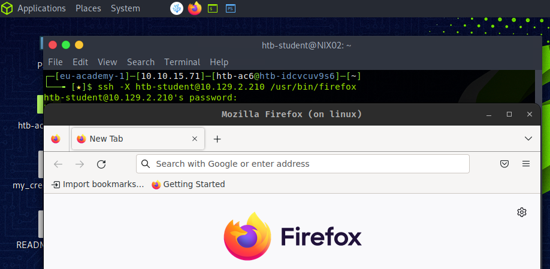
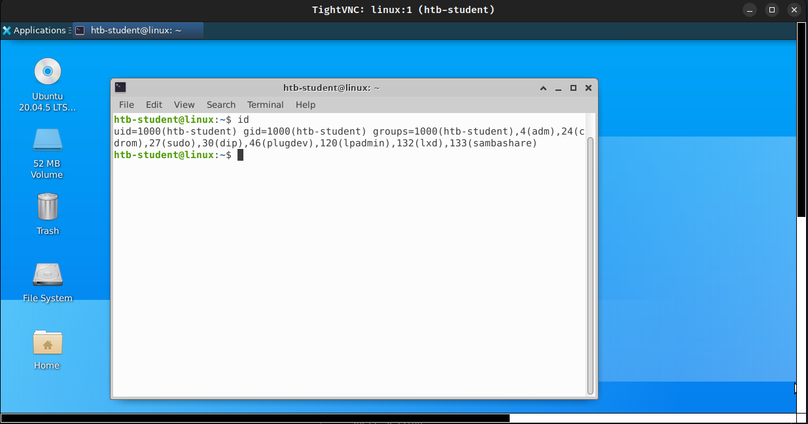

### **Protocolos de Escritorio Remoto en Linux**

Los protocolos de escritorio remoto se utilizan en Windows, Linux y macOS para proporcionar acceso gráfico remoto a un sistema. Estos protocolos permiten a los administradores gestionar, solucionar problemas y actualizar sistemas de forma remota, lo que los convierte en herramientas esenciales para dichos escenarios. Para ello, un administrador se conecta al sistema remoto utilizando el protocolo adecuado según el sistema operativo que esté gestionando.

Por ejemplo, cuando los administradores necesitan instalar software o gestionar un sistema remoto, utilizan el protocolo correspondiente para establecer una sesión gráfica. Dos de los protocolos más comunes para este tipo de acceso son:

*   **Protocolo de Escritorio Remoto (RDP):** Utilizado principalmente en entornos Windows. RDP permite a los administradores conectarse de forma remota e interactuar con el escritorio de una máquina Windows como si estuvieran sentados justo frente a ella.
*   **Virtual Network Computing (VNC):** Un protocolo popular en entornos Linux, aunque también es multiplataforma. VNC proporciona acceso gráfico a escritorios remotos, permitiendo a los administradores realizar tareas en sistemas Linux de manera similar a RDP en Windows.

Piensa en los protocolos de escritorio remoto como si tuvieras diferentes juegos de llaves para distintos tipos de edificios. **RDP** es como tener una llave hecha específicamente para edificios Windows, que te permite acceder y gestionar las habitaciones (escritorios) de forma remota, como si estuvieras dentro. **VNC**, por otro lado, es más como una llave universal que puede funcionar en muchos edificios, pero se usa a menudo para estructuras Linux. Así como usarías la llave apropiada dependiendo del edificio, los administradores eligen el protocolo correcto según el sistema al que necesitan acceder y controlar.

### **XServer**

El XServer es la parte del lado del usuario del protocolo de red del Sistema de Ventanas X (X11 / X). El X11 es un sistema fijo que consiste en una colección de protocolos y aplicaciones que nos permiten llamar a ventanas de aplicaciones en pantallas dentro de una interfaz gráfica de usuario. X11 es predominante en sistemas Unix, pero también hay servidores X disponibles para otros sistemas operativos. Hoy en día, el XServer es parte de casi todas las instalaciones de escritorio de Ubuntu y sus derivados y no necesita ser instalado por separado.

Cuando se inicia un escritorio en un ordenador Linux, la comunicación de la interfaz gráfica de usuario con el sistema operativo se realiza a través de un servidor X. Se utiliza la red interna del ordenador, incluso si el ordenador no estuviera en una red. Lo práctico del protocolo X es la transparencia de red. Este protocolo utiliza principalmente TCP/IP como base de transporte, pero también puede usarse sobre sockets Unix puros. Los puertos que se utilizan para el servidor X suelen estar en el rango de **TCP/6001-6009**, permitiendo la comunicación entre el cliente y el servidor. Al iniciar una nueva sesión de escritorio a través del servidor X, se abriría el puerto TCP 6000 para la primera pantalla X `:0`. Este rango de puertos permite al servidor realizar sus tareas, como alojar aplicaciones, así como proporcionar servicios a los clientes. A menudo se utilizan para proporcionar acceso remoto a un sistema, permitiendo a los usuarios acceder a aplicaciones y datos desde cualquier parte del mundo. Además, estos puertos también son esenciales para el intercambio seguro de archivos y datos, lo que los convierte en una parte integral del Open X Server. Por lo tanto, un servidor X no depende del ordenador local, puede usarse para acceder a otros ordenadores, y otros ordenadores pueden usar el servidor X local. Siempre que tanto el ordenador local como el remoto contengan sistemas Unix/Linux, los protocolos adicionales como VNC y RDP son superfluos. VNC y RDP generan la salida gráfica en el ordenador remoto y la transportan a través de la red. Mientras que con X11, se renderiza en el ordenador local. Esto ahorra tráfico y carga en el ordenador remoto. Sin embargo, la desventaja significativa de X11 es la transmisión de datos sin cifrar. No obstante, esto se puede superar tunelizando el protocolo SSH.

Para ello, tenemos que permitir la redirección de X11 (*X11 forwarding*) en el archivo de configuración de SSH (`/etc/ssh/sshd_config`) en el servidor que proporciona la aplicación, cambiando esta opción a `yes`.

**X11Forwarding**
```bash
foonkeemoonkee@htb[/htb]$ cat /etc/ssh/sshd_config | grep X11Forwarding```
```
X11Forwarding yes
```
Con esto podemos iniciar la aplicación desde nuestro cliente con el siguiente comando:
```bash
foonkeemoonkee@htb[/htb]$ ssh -X htb-student@10.129.23.11 /usr/bin/firefox
```
```
htb-student@10.129.14.130's password: ********
<SKIP>
```


#### **Seguridad de X11**
Como mencionamos anteriormente, X11 no es un protocolo seguro por defecto porque su comunicación no está cifrada. Por lo tanto, debemos prestar atención y buscar esos puertos TCP (6000-6010) cuando tratamos con objetivos basados en Linux. Sin las medidas de seguridad adecuadas, un servidor X abierto puede exponer datos sensibles a través de la red. Por ejemplo, un atacante en la misma red podría leer el contenido de las ventanas del servidor X sin el conocimiento del usuario, lo que hace innecesario incluso realizar un *sniffing* de red tradicional. Esta vulnerabilidad permite graves brechas de seguridad. Un atacante podría interceptar información sensible, como contraseñas o datos personales, simplemente usando herramientas estándar de X11 como `xwd` (que captura pantallas de ventanas X) y `xgrabsc`.

Además de esto, se han descubierto otras vulnerabilidades de seguridad a lo largo de los años, relacionadas con las bibliotecas de XServer y el propio software. Por ejemplo, en 2017, se encontró una colección de vulnerabilidades en XOrg Server, una implementación de código abierto del Sistema de Ventanas X. Derivadas de claves de sesión débiles, predecibles o que se pueden forzar por fuerza bruta, cuya explotación podría permitir a un atacante ejecutar código arbitrario en la sesión Xorg de otro usuario. Se vieron afectados una amplia gama de sistemas, como Unix, Red Hat Enterprise Linux, Ubuntu Linux y SUSE Linux. Estas vulnerabilidades se conocieron como CVE-2017-2624, CVE-2017-2625 y CVE-2017-2626. Este [artículo](https://www.zdnet.com/article/xorg-server-vulnerabilities-open-linux-and-unix-to-attackers/) proporciona un excelente resumen.

### **XDMCP**
El protocolo X Display Manager Control Protocol (XDMCP) es utilizado por el X Display Manager para la comunicación a través del puerto UDP 177 entre terminales X y ordenadores que operan bajo Unix/Linux. Se utiliza para gestionar sesiones remotas del Sistema de Ventanas X en otras máquinas y es utilizado a menudo por los administradores de sistemas Linux para proporcionar acceso a escritorios remotos. XDMCP es un protocolo inseguro y no debe utilizarse en ningún entorno que requiera altos niveles de seguridad. Con esto, es posible redirigir una interfaz gráfica de usuario (GUI) completa (como KDE o Gnome) a un cliente correspondiente. Para que un sistema Linux actúe como un servidor XDMCP, debe instalarse y configurarse un sistema X con una GUI en el servidor. Después de iniciar el ordenador, una interfaz gráfica debería estar disponible localmente para el usuario.

Una forma potencial en que XDMCP podría ser explotado es a través de un ataque de "hombre en el medio" (*man-in-the-middle*). En este tipo de ataque, un atacante intercepta la comunicación entre el ordenador remoto y el servidor del Sistema de Ventanas X, y se hace pasar por una de las partes para obtener acceso no autorizado al servidor. El atacante podría entonces usar el servidor para ejecutar comandos arbitrarios, acceder a datos sensibles o realizar otras acciones que podrían comprometer la seguridad del sistema.

### **VNC**
Virtual Network Computing (VNC) es un sistema de compartición de escritorio remoto basado en el protocolo RFB que permite a los usuarios controlar un ordenador de forma remota. Permite a un usuario ver e interactuar con un entorno de escritorio de forma remota a través de una conexión de red. El usuario puede controlar el ordenador remoto como si estuviera sentado frente a él. Este es también uno de los protocolos más comunes para conexiones gráficas remotas para anfitriones Linux.

VNC generalmente se considera seguro. Utiliza cifrado para garantizar que los datos estén seguros mientras están en tránsito y requiere autenticación antes de que un usuario pueda obtener acceso. Los administradores utilizan VNC para acceder a ordenadores que no son físicamente accesibles. Esto podría usarse para solucionar problemas y mantener servidores, acceder a aplicaciones en otros ordenadores o proporcionar acceso remoto a estaciones de trabajo. VNC también se puede utilizar para compartir pantalla, permitiendo que varios usuarios colaboren en un proyecto o solucionen un problema.

Existen dos conceptos diferentes para los servidores VNC. El servidor habitual ofrece la pantalla real del ordenador anfitrión para soporte al usuario. Debido a que el teclado y el ratón permanecen utilizables en el ordenador remoto, se recomienda un acuerdo previo. El segundo grupo de programas de servidor permite el inicio de sesión del usuario en sesiones virtuales, similar al concepto de servidor de terminales.

Existen programas de servidor y visor para VNC para todos los sistemas operativos comunes. Por lo tanto, muchos servicios de TI se realizan con VNC. Los programas propietarios TeamViewer y RDP tienen usos similares.

Tradicionalmente, el servidor VNC escucha en el puerto TCP 5900. Así que ofrece su pantalla `:0` allí. Se pueden ofrecer otras pantallas a través de puertos adicionales, principalmente `590[x]`, donde `x` es el número de la pantalla. La adición de múltiples conexiones se asignaría a un puerto TCP más alto como 5901, 5902, 5903, etc.

Para estas conexiones VNC, se utilizan muchas herramientas diferentes. Entre ellas se encuentran, por ejemplo:

*   TigerVNC
*   TightVNC
*   RealVNC
*   UltraVNC

Las herramientas más utilizadas para este tipo de conexiones son UltraVNC y RealVNC debido a su cifrado y mayor seguridad.

En este ejemplo, configuramos un servidor TigerVNC, y para ello necesitamos, entre otras cosas, también el gestor de escritorio XFCE4, ya que las conexiones VNC con GNOME son algo inestables. Por lo tanto, necesitamos instalar los paquetes necesarios y crear una contraseña para la conexión VNC.

**Instalación de TigerVNC**
```bash
htb-student@ubuntu:~$ sudo apt install xfce4 xfce4-goodies tigervnc-standalone-server -y
htb-student@ubuntu:~$ vncpasswd
```
```
Password: ******
Verify: ******
Would you like to enter a view-only password (y/n)? n
```
Durante la instalación, se crea una carpeta oculta en el directorio de inicio llamada `.vnc`. Luego, tenemos que crear dos archivos adicionales, `xstartup` y `config`. El `xstartup` determina cómo se crea la sesión VNC en conexión con el gestor de pantalla, y el `config` determina sus ajustes.

**Configuración**
```bash
htb-student@ubuntu:~$ touch ~/.vnc/xstartup ~/.vnc/config
htb-student@ubuntu:~$ cat <<EOT >> ~/.vnc/xstartup
```
```bash
#!/bin/bash
unset SESSION_MANAGER
unset DBUS_SESSION_BUS_ADDRESS
/usr/bin/startxfce4
[ -x /etc/vnc/xstartup ] && exec /etc/vnc/xstartup
[ -r $HOME/.Xresources ] && xrdb $HOME/.Xresources
x-window-manager &
EOT
```
```bash
htb-student@ubuntu:~$ cat <<EOT >> ~/.vnc/config
```
```
geometry=1920x1080
dpi=96
EOT
```
Adicionalmente, el ejecutable `xstartup` necesita permisos para ser iniciado por el servicio.
```bash
htb-student@ubuntu:~$ chmod +x ~/.vnc/xstartup
```
Ahora podemos iniciar el servidor VNC.

**Iniciar el servidor VNC**
```bash
htb-student@ubuntu:~$ vncserver
```
```
New 'linux:1 (htb-student)' desktop at :1 on machine linux

Starting applications specified in /home/htb-student/.vnc/xstartup
Log file is /home/htb-student/.vnc/linux:1.log

Use xtigervncviewer -SecurityTypes VncAuth -passwd /home/htb-student/.vnc/passwd :1 to connect to the VNC server.
```
Además, también podemos mostrar todas las sesiones con los puertos asociados y el ID del proceso.

**Listar Sesiones**
```bash
htb-student@ubuntu:~$ vncserver -list```
```
TigerVNC server sessions:

X DISPLAY #     RFB PORT #      PROCESS ID
:1              5901            79746
```
Para cifrar la conexión y hacerla más segura, podemos crear un túnel SSH sobre el cual se tuneliza toda la conexión. Cómo funciona la tunelización en detalle lo aprenderemos en el módulo de *Pivoting, Tunneling, and Port Forwarding*.

**Configurando un Túnel SSH**
```bash
foonkeemoonkee@htb[/htb]$ ssh -L 5901:127.0.0.1:5901 -N -f -l htb-student 10.129.14.130
```
```
htb-student@10.129.14.130's password: *******
```
Finalmente, podemos conectarnos al servidor a través del túnel SSH usando `xtightvncviewer`.

**Conectando al Servidor VNC**
```bash
foonkeemoonkee@htb[/htb]$ xtightvncviewer localhost:5901
```
```
Connected to RFB server, using protocol version 3.8
Performing standard VNC authentication

Password: ******

Authentication successful
Desktop name "linux:1 (htb-student)"
VNC server default format:
  32 bits per pixel.
  Least significant byte first in each pixel.
  True colour: max red 255 green 255 blue 255, shift red 16 green 8 blue 0
Using default colormap which is TrueColor.  Pixel format:
  32 bits per pixel.
  Least significant byte first in each pixel.
  True colour: max red 255 green 255 blue 255, shift red 16 green 8 blue 0
Same machine: preferring raw encoding
```

```
